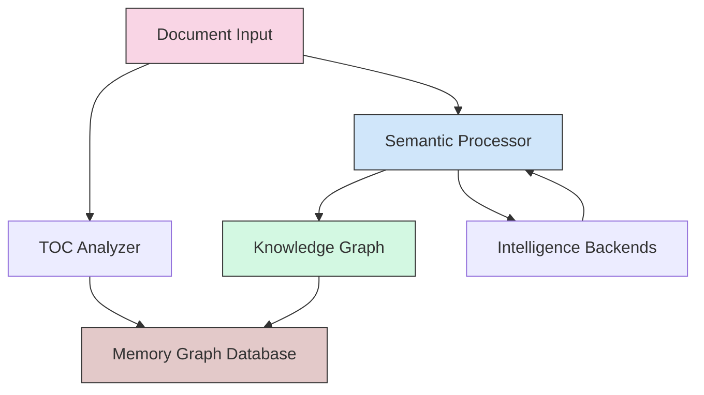

# Memory Graph Extract Architecture

This document outlines the architecture of Memory Graph Extract, focusing on its core purpose: transforming PDF documents into semantic knowledge graphs for intelligent understanding.

## Architectural Evolution

Memory Graph Extract has evolved from a document processing tool to a semantic knowledge graph builder. This evolution prioritizes semantic understanding and makes the memory graph central to the system's operation.

### Core Principles

1. **Semantic Focus**: Understanding document meaning, not just extracting text
2. **Memory Graph Centrality**: Knowledge graphs as the primary output
3. **Separation of Concerns**: Clear boundaries between processing stages
4. **Single Responsibility**: Each component focuses on one aspect of processing
5. **Code Quality**: Maintainable, modular implementation

## Core Vision

Memory Graph Extract is designed as a semantic understanding engine that creates queryable knowledge graphs from PDF documents. Instead of just extracting text, it builds a semantic network capturing:

- Document structure and hierarchies
- Relationships between content elements
- Cross-document connections
- Contextual understanding of information

## Architecture Overview



## Component Structure

### 1. Semantic Processing Layer

The core of the system, focused on understanding and graph construction:

- **SemanticOrchestrator**: Central coordinator for extraction pipeline
- **GraphBuilder**: Constructs interconnected knowledge networks  
- **StructureAnalyzer**: Detects document organization and hierarchies
- **ContentAnalyzer**: Performs initial analysis and relationship detection

### 2. Intelligence Layer

AI backends that enhance semantic understanding:

- **IntelligenceBackend** (base)
  - **MarkitdownBackend**: Direct semantic extraction
  - **OllamaBackend**: AI-enhanced understanding with multimodal support
  - **OpenAIBackend**: Cloud-based semantic processing
  - **MemoryEnhancedBackend**: Context-aware processing

### 3. Memory Graph Layer

Graph database operations and structures:

```
Document (root)
├── Page Nodes
│   ├── "part_of" → Document
│   └── "precedes/follows" → Other Pages
├── Section Nodes
│   ├── "part_of" → Document
│   ├── "contains" → Pages
│   └── "relates_to" → Other Sections
└── Concept Nodes
    ├── "mentioned_in" → Pages/Sections
    └── "related_to" → Other Concepts
```

## Processing Pipeline

### 1. Structure Discovery
- Extract existing TOC or construct from content
- Establish document hierarchy

### 2. Initial Analysis
- Word stem extraction
- Bayesian term analysis
- Basic relationship mapping

### 3. Semantic Enhancement
- LLM-based understanding
- Context-aware page processing
- Graph enrichment with confidence-scored edges

### 4. Output Generation
- JSON graph with ontological tagging
- SQLite database (memory-graph format)
- Confidence scoring throughout

## Command Line Interface

The CLI reflects the semantic focus:

```
mge semantic process - Process with semantic understanding
mge process          - Legacy extraction flow
mge memory           - Interact with knowledge graphs
  ├── search         - Semantic search across graphs
  ├── info           - Graph statistics and structure
  ├── connect        - Link related documents
  └── export         - Export graph data

mge render           - Utility for image generation
mge ocr              - Utility for text extraction
```

## Configuration Approach

Configuration emphasizes semantic understanding:

```yaml
# Semantic pipeline configuration
llm_backend:
  type: "openai"      # Options: openai, ollama, http
  
pipeline:
  enable_llm: true    # Use LLM for understanding
  parallel_pages: 4   # Process multiple pages at once
  
graph_construction:
  ontology_domains:   # Domain-specific tagging
    technical: ["algorithm", "system"]
    academic: ["theory", "methodology"]
```

## Integration Points

The system is designed to integrate with:

1. **Memory Graph MCP**: Direct database compatibility
2. **Memory Graph Interface**: Web-based graph visualization
3. **Claude Desktop**: Knowledge-enhanced AI assistance

## Future Considerations

- Enhanced relationship detection
- Cross-document intelligence
- Interactive graph refinement
- Performance optimization for large documents

The architecture prioritizes semantic understanding while maintaining flexibility for different document types and processing needs.