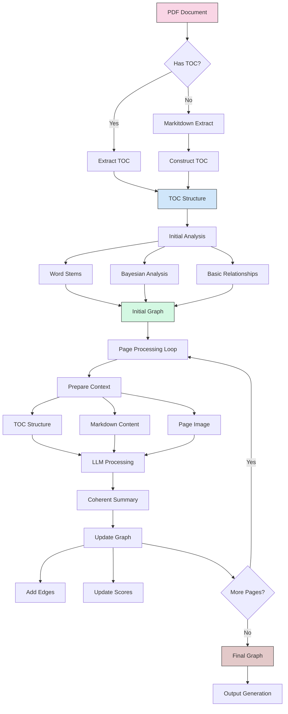

# Semantic Pipeline

This document provides an overview of the semantic processing pipeline in Memory Graph Extract, which transforms documents into knowledge graphs.

## Pipeline Architecture



## Pipeline Stages

### 1. Structure Discovery

The pipeline begins by establishing the document's hierarchical structure:

- **TOC Detection**: Checks if the document contains a table of contents
- **Direct Extraction**: When a TOC exists, extracts it directly preserving structure
- **Fallback Mechanism**: For documents without TOC, uses markitdown to extract content
- **Synthetic TOC**: Constructs a hierarchical structure from headings and sections

### 2. Initial Analysis

With the document structure established, initial analysis creates a preliminary semantic framework:

- **Word Stem Extraction**: Identifies core concepts through stemming and frequency analysis
- **Bayesian Analysis**: Applies probabilistic models to detect relationships between terms
- **Basic Relationship Mapping**: Establishes initial connections between document sections
- **Preliminary Graph Construction**: Creates an initial knowledge graph based on lexical features

### 3. Semantic Enhancement

The core of the pipeline enhances the graph with deep semantic understanding:

- **Page-by-Page Processing**: Each document page is processed individually
- **Context Preparation**: Combines TOC structure, markdown content, and page images
- **Multimodal LLM Processing**: Uses AI models to analyze both textual and visual content
- **Coherent Summarization**: Produces semantic descriptions of content meaning
- **Graph Updates**: Adds high-confidence edges and updates relationship scores

### 4. Output Generation

The final phase produces a structured representation of the document's knowledge:

- **Graph Structure**: Captures nodes (concepts, sections, pages) and edges (relationships)
- **Ontological Tagging**: Labels concepts according to domain-specific categories
- **Relationship Typing**: Classifies edges with semantic relationship types
- **Confidence Scoring**: Includes confidence metrics for all elements
- **SQLite Database**: Compatible with the memory-graph ecosystem

## Intelligence Backends

The semantic pipeline supports multiple AI backends for different needs:

1. **OpenAI** (highest quality)
   - Multimodal understanding via GPT-4V/GPT-4o
   - Requires API key
   - Works on any hardware

2. **Ollama** (local processing)
   - Uses models like LLaVA
   - Free but requires GPU
   - Works offline

3. **Markitdown** (no AI)
   - Basic text extraction
   - No semantic enhancement
   - Fast processing

## Using the Pipeline

Basic usage through the CLI:

```bash
# Process with OpenAI backend
mge semantic process document.pdf output/ --backend openai

# Process with local Ollama
mge semantic process document.pdf output/ --backend ollama

# Basic processing without AI
mge semantic process document.pdf output/ --no-llm
```

For configuration options and advanced usage, see [Configuration Guide](configuration.md).

## Graph Output

The semantic pipeline produces:

1. **Knowledge Graph**: A network of interconnected nodes and relationships
2. **Node Types**:
   - **document**: Root document node
   - **section**: Document sections from TOC
   - **page**: Individual pages
   - **concept**: Extracted concepts
3. **Edge Types**:
   - **contains**: Hierarchical containment
   - **precedes**: Sequential relationship
   - **relates_to**: Semantic connection
   - **references**: Direct reference

## Integration

The generated graph can be used with:

- **Memory Graph MCP**: For AI assistant access to document knowledge
- **Memory Graph Interface**: For human exploration of the graph
- **Custom Applications**: Through the SQLite database or JSON export