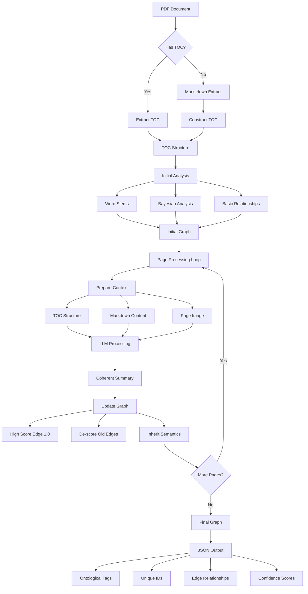

# Semantic Pipeline Visual Model

## Pipeline Flow

1. **Structure Discovery Phase**
   - Check for existing TOC
   - Fall back to markitdown extraction
   - Build hierarchical structure

2. **Initial Analysis Phase**
   - Extract word stems
   - Perform Bayesian analysis
   - Identify basic relationships
   - Create preliminary graph

3. **Semantic Enhancement Phase**
   - Process each page iteratively
   - Combine TOC context with content
   - Use LLM for deep understanding
   - Update graph with high-confidence edges

4. **Output Generation Phase**
   - Produce JSON graph structure
   - Include ontological tagging
   - Maintain relationship scoring
   - Enable semantic querying

## Key Components

### Nodes
- Document sections/pages
- Semantic summaries
- Ontological categories
- Confidence scores

### Edges
- Inter-section relationships
- Weighted by confidence
- Typed connections
- Bidirectional where appropriate

### Context Management
- TOC provides global context
- Page content provides local detail
- LLM bridges understanding
- Context size limits respected