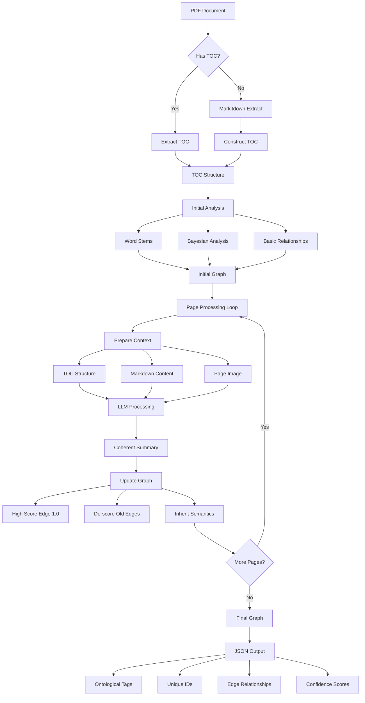

# Semantic Pipeline: Advanced Document Knowledge Graph

This document describes a sophisticated system for extracting structured, semantic information from PDF documents. The architecture transforms flat document content into rich, traversable knowledge graphs that preserve semantic relationships beyond simple vector similarity.

## Pipeline Architecture



## Pipeline Phases

### 1. Structure Discovery Phase

The pipeline begins by establishing the document's hierarchical structure:

- **TOC Detection**: Identifies whether the document contains a table of contents
- **Direct Extraction**: When TOC exists, extracts it directly preserving the original structure
- **Fallback Mechanism**: For documents without TOC, uses Microsoft's Markitdown to extract content
- **Synthetic TOC**: Constructs a hierarchical structure from extracted headings and sections
- **Unified Structure**: Both paths converge to create a consistent TOC structure for further processing

### 2. Initial Analysis Phase

With the document structure established, initial analysis creates a preliminary semantic framework:

- **Word Stem Extraction**: Identifies core concepts through stemming and frequency analysis
- **Bayesian Analysis**: Applies probabilistic models to detect relationships between terms and sections
- **Basic Relationship Mapping**: Establishes initial connections between document sections
- **Preliminary Graph Construction**: Creates an initial knowledge graph based on lexical features

### 3. Semantic Enhancement Phase

The core of the pipeline iteratively enhances the graph with deep semantic understanding:

- **Page-by-Page Processing**: Each document page is processed individually within the context of the whole
- **Context Preparation**: Combines TOC structure, markdown content, and page images
- **Multimodal LLM Processing**: Uses advanced language models to analyze both textual and visual content
- **Coherent Summarization**: Produces semantic descriptions capturing the intended meaning of content
- **Graph Updates**:
  - Adds high-confidence semantic edges (score 1.0)
  - Gradually de-scores older, less relevant edges
  - Propagates semantic understanding through inheritance

### 4. Output Generation Phase

The final phase produces a structured representation of the document's knowledge:

- **JSON Graph Structure**: Encodes the entire semantic network in a standard format
- **Ontological Tagging**: Labels concepts according to domain-specific taxonomies
- **Relationship Typing**: Classifies edges with semantic relationship types
- **Confidence Scoring**: Includes confidence metrics for all nodes and edges
- **Queryable Output**: Enables sophisticated traversal and inference operations

## Key Components

### Nodes

- **Document Sections**: Correspond to structural elements from the TOC
- **Page Content**: Represents specific content blocks within sections
- **Semantic Summaries**: LLM-generated descriptions of content intention
- **Ontological Categories**: Domain-specific conceptual groupings

### Edges

- **Structural Relationships**: Based on document hierarchy
- **Semantic Connections**: Based on meaning and intent
- **Weighted Links**: Scored by confidence and recency
- **Typed Relationships**: Categorized by relationship nature

### LLM Integration

The language model component serves multiple critical functions:

- **Multimodal Understanding**: Processes both text and images to comprehend content
- **Intention Extraction**: Captures the semantic purpose rather than just surface content
- **Coherent Summarization**: Creates descriptions detailed enough to reproduce original intent
- **Semantic Inheritance**: Propagates understanding across related nodes

## Implementation Considerations

### Edge Scoring Mechanism

The system uses a sophisticated approach to edge weighting:

```
final_edge_score = base_lexical_similarity * semantic_multiplier * recency_factor
```

- **Lexical Base**: Derived from Bayesian analysis and word stem relationships
- **Semantic Multiplier**: Higher weight given to LLM-identified semantic connections
- **Recency Factor**: Gradually de-scores older edges to maintain relevance
- **Priority**: Semantic-to-semantic connections receive highest priority

### Parallelization Strategy

Processing can be optimized through targeted parallelization:

- **Coherent Summarization**: Primary candidate for parallel execution
- **Queue-Based Processing**: Independent page processing through job queues
- **Resource Adaptation**: Scaling based on available computational resources
- **API Considerations**: N1 token consumption rate when using external API endpoints

### Handling Limitations

The system addresses several practical constraints:

- **TOC Size Limits**: For extremely large documents, partitioning into logical "chapters"
- **Context Windows**: Careful management of context to fit within LLM token limitations
- **Visual Content**: Currently optimized for text-heavy documents; purely visual content requires specialized approaches
- **Low Quality Summaries**: Implements confidence checks with fallback mechanisms

## Advanced Features and Benefits

### Beyond Vector Similarity

This approach transcends conventional vector database limitations:

- **Structured Understanding**: Captures relationships beyond simple text similarity
- **Intention Preservation**: Maintains the purpose and meaning of document content
- **Multi-dimensional Context**: Incorporates hierarchy, visual elements, and semantic links

### MCP Server Integration

Designed to work with Model-Context-Prompting servers for intelligent graph traversal:

- **Guided Exploration**: Enables LLMs to follow meaningful semantic paths
- **Reduced Hallucination**: Grounds responses in actual document relationships
- **Emergent Insights**: Facilitates discovery of connections not explicitly stated

### Application Domains

While adaptable to various content types, the system is especially valuable for:

- **Technical Documentation**: Capturing complex interdependencies between concepts
- **Research Papers**: Preserving nuanced relationships between findings and evidence
- **Educational Content**: Mapping conceptual hierarchies and prerequisite relationships
- **Business Intelligence**: Extracting actionable insights from complex business documents

## Future Directions

The architecture supports several potential extensions:

- **Cross-Document Linking**: Connecting knowledge graphs across multiple documents
- **Temporal Versioning**: Tracking semantic evolution across document versions
- **Interactive Refinement**: Incorporating expert feedback to validate semantic connections
- **Domain-Specific Ontologies**: Extending ontological frameworks for specialized fields

---

*This pipeline represents an opinionated approach to document understanding that prioritizes semantic structure and traversable knowledge over simple text matching or vector similarity.*